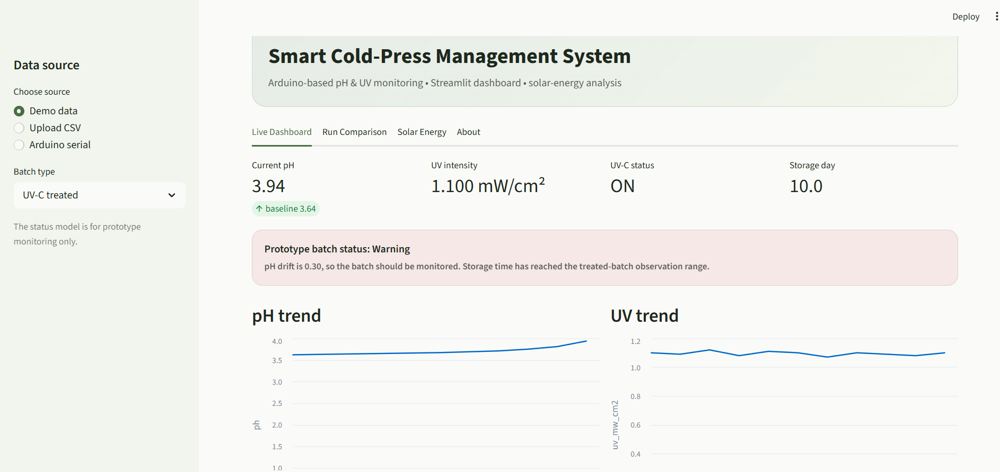
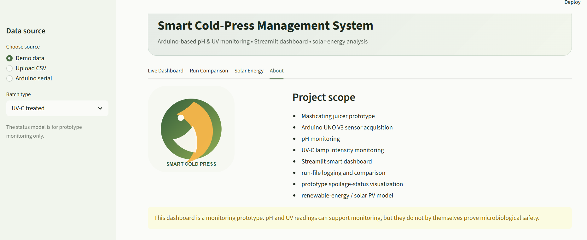

# Smart Cold-Press Management System

An Arduino + Streamlit system for monitoring a cold-press juicing setup: pH and UV-C intensity sensing, run logging/comparison, a prototype spoilage-status heuristic, and a solar-energy sizing model for powering the whole rig.

## Features

- Streamlit monitoring dashboard
- Arduino UNO V3 firmware for pH + UV sensor acquisition
- CSV logging, upload, and run comparison
- Prototype spoilage-status logic
- Solar-energy sizing model
- Sample datasets for demoing without hardware

## Project structure

```text
Smart_Cold_Press/
├── app.py
├── config.py
├── data_utils.py
├── energy.py
├── serial_reader.py
├── spoilage.py
├── styles.css
├── requirements.txt
├── run_dashboard.bat
├── run_dashboard.sh
├── .streamlit/
│   └── config.toml
├── arduino/
│   └── SmartColdPress/
│       └── SmartColdPress.ino
├── assets/
│   ├── logo.svg
│   └── system_architecture.svg
├── data/
│   ├── sample_treated_run.csv
│   └── sample_untreated_run.csv
└── docs/
    ├── WIRING_AND_CALIBRATION.md
    └── DATA_FORMAT.md
```

## Screenshots

**Live dashboard** — current pH, UV intensity, UV-C status, storage day, and prototype batch status:



**About page** — project scope and the monitoring-only disclaimer:



## Quick start

### Windows

1. Install Python 3.10+.
2. Open Command Prompt in this folder.
3. Run:

```bat
python -m venv .venv
.venv\Scripts\activate
pip install -r requirements.txt
streamlit run app.py
```

Or double-click `run_dashboard.bat`.

### macOS / Linux

```bash
python3 -m venv .venv
source .venv/bin/activate
pip install -r requirements.txt
streamlit run app.py
```

Or:

```bash
chmod +x run_dashboard.sh
./run_dashboard.sh
```

## Arduino setup

Open `arduino/SmartColdPress/SmartColdPress.ino` in the Arduino IDE and upload it to the Arduino UNO V3.

Default prototype pins:
- pH sensor analog output → A0
- UV sensor analog output → A1
- optional UV-C relay/control signal → D7

The Arduino sends one CSV row through Serial every second.

## Sensor calibration

The calibration constants in `SmartColdPress.ino` are intentionally easy to edit.

### pH

Use at least two known reference liquids / buffer solutions and update:

```cpp
PH_SLOPE
PH_INTERCEPT
```

### UV

The UV sensor in this project measures **lamp intensity above the juice container**, not absorption through the juice. Calibrate the sensor against a known UV-C meter if absolute mW/cm² values are required.

Update:

```cpp
UV_SLOPE
UV_INTERCEPT
```

Raw ADC and voltage values are always transmitted even before full UV calibration.

## Dashboard modes

The sidebar supports:

1. **Demo data** — immediately shows the included sample run.
2. **Upload CSV** — analyze an exported run file.
3. **Arduino serial** — read the connected Arduino directly.

## Spoilage status

The dashboard status is a **prototype heuristic**, not a microbiological safety certification. It mainly uses pH drift from the batch baseline and elapsed storage time for visualization/monitoring. It should not be used as a replacement for laboratory microbial testing or official food-safety requirements.

## Solar model

The default model uses:
- UV-C chamber: 0.005 kWh/day
- HPP generator: 1.7 kWh/day
- cold storage: 4.8 kWh/day
- measuring/lab devices: 0.07 kWh/day
- total: 6.575 kWh/day ≈ 7 kWh/day
- peak sun hours: 5.5 h/day
- system efficiency: 75%
- design PV size: ~1.7 kW
- panel rating: 550 W
- practical installation area: ~14–16 m²

The dashboard lets you change these values interactively.

## Safety

UV-C radiation can injure eyes and skin. Do not operate exposed UV-C lamps around people. The relay/control example should be implemented with proper electrical isolation, enclosure, interlocks, and supervision.
